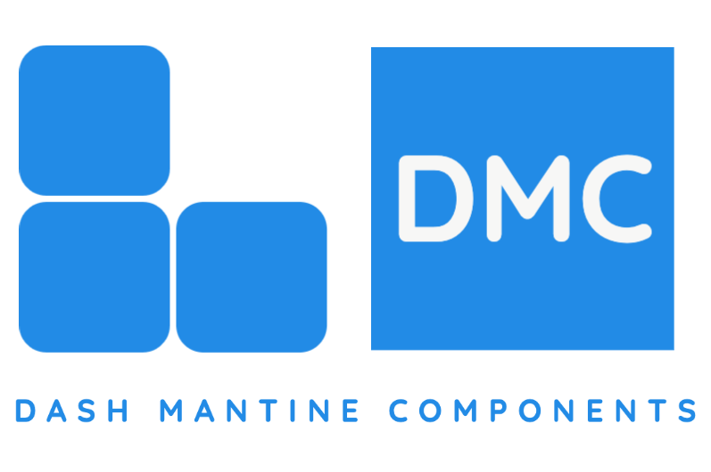
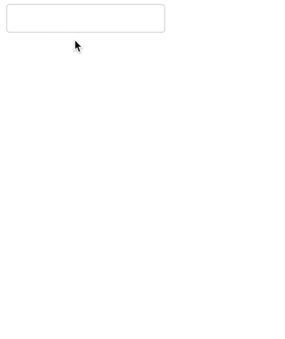

<p align="center">
    
</p>
<p align="center">
    
    <a href="https://discord.gg/KuJkh4Pyq5">
    
    </a>
</p>

Dash Mantine Components is an extensive (50+) Dash components library based on [Mantine](https://mantine.dev/) React Components Library. It makes it easier to create good quality dashboards with very well designed components out of the box.

[Documentation](https://dash-mantine-components.herokuapp.com)

<p align="center">
    
</p>

### Table of contents

- [Installation](#installation)
- [Quickstart](#quickstart)
- [Contributing](#contributing)
- [TODO](#todo)

## Installation

```bash
pip install dash-mantine-components
```

## Quickstart

```python
import dash_mantine_components as dmc
from dash import Dash, Input, Output

app = Dash(__name__)

app.layout = html.Div(
    [
        dmc.DatePicker(id="datepicker", format="dddd, MMMM D, YYYY"),
        dmc.Text(id="text"),
        dmc.Button("Click Me!")
    ]
)


@app.callback(Output("text", "children"), Input("datepicker", "date"))
def datepicker(date):
    return date


if __name__ == "__main__":
    app.run_server(debug=True)
```

## Contributing

1. Install virtual environment:

    ```bash
    python -m venv venv
    source venv/bin/activate
    pip install -r requirements.txt
    ```

2. Install npm dependencies

    ```bash
    npm install
    ```

3. Add your new component in `src/lib/components`. Make sure to include it in the `src/lib/index.js` as well.

4. Add a line in the CHANGELOG.md under one of these: Added, Changed, Deprecated, Removed, Fixed.

5. Raise a PR, including an example to reproduce the changes contributed by the PR.

## TODO

1. Add more components from Mantine library and enhance already added ones.
2. Support dark theme.
3. Add contributing guide.
4. Add testing.
